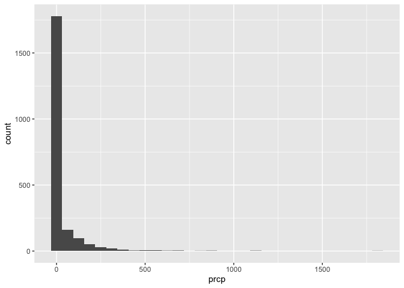
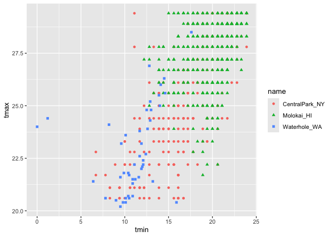

EDA
================
Yifei Yu
2024-10-04

``` r
library(tidyverse) 
```

    ## ── Attaching core tidyverse packages ──────────────────────── tidyverse 2.0.0 ──
    ## ✔ dplyr     1.1.4     ✔ readr     2.1.5
    ## ✔ forcats   1.0.0     ✔ stringr   1.5.1
    ## ✔ ggplot2   3.5.1     ✔ tibble    3.2.1
    ## ✔ lubridate 1.9.3     ✔ tidyr     1.3.1
    ## ✔ purrr     1.0.2     
    ## ── Conflicts ────────────────────────────────────────── tidyverse_conflicts() ──
    ## ✖ dplyr::filter() masks stats::filter()
    ## ✖ dplyr::lag()    masks stats::lag()
    ## ℹ Use the conflicted package (<http://conflicted.r-lib.org/>) to force all conflicts to become errors

Import the weather data

``` r
weather_df = 
  read_csv("weather_df.csv") |> 
  filter(
    id %in% c("USW00094728", "USW00022534", "USS0023B17S"), 
    
    date >= "2021-01-01", 
    date <= "2022-12-31"
  ) |> 
  mutate(
    name = case_match(
      id, 
      "USW00094728" ~ "CentralPark_NY", 
      "USW00022534" ~ "Molokai_HI",
      "USS0023B17S" ~ "Waterhole_WA"),
    tmin = tmin,
    tmax = tmax,
    month = floor_date(date, unit = "month")) |> 
  select(name, id, date, prcp, tmin, tmax, month) 
```

    ## Rows: 2190 Columns: 6
    ## ── Column specification ────────────────────────────────────────────────────────
    ## Delimiter: ","
    ## chr  (2): name, id
    ## dbl  (3): prcp, tmax, tmin
    ## date (1): date
    ## 
    ## ℹ Use `spec()` to retrieve the full column specification for this data.
    ## ℹ Specify the column types or set `show_col_types = FALSE` to quiet this message.

Let’s make some plots

``` r
weather_df |> 
  ggplot(aes(x = prcp)) +
  geom_histogram()
```

    ## `stat_bin()` using `bins = 30`. Pick better value with `binwidth`.

    ## Warning: Removed 15 rows containing non-finite outside the scale range
    ## (`stat_bin()`).

<!-- -->

``` r
weather_df |> 
  filter(prcp > 1000)
```

    ## # A tibble: 3 × 7
    ##   name           id          date        prcp  tmin  tmax month     
    ##   <chr>          <chr>       <date>     <dbl> <dbl> <dbl> <date>    
    ## 1 CentralPark_NY USW00094728 2021-08-21  1130  22.8  27.8 2021-08-01
    ## 2 CentralPark_NY USW00094728 2021-09-01  1811  17.2  25.6 2021-09-01
    ## 3 Molokai_HI     USW00022534 2022-12-18  1120  18.9  23.3 2022-12-01

``` r
weather_df |> 
  filter(tmax > 20, tmax < 30) |> 
  ggplot(aes(x = tmin, y = tmax, color = name, shape = name)) +
  geom_point()
```

<!-- -->

## group_by()

``` r
weather_df |> 
  group_by(name)
```

    ## # A tibble: 2,190 × 7
    ## # Groups:   name [3]
    ##    name           id          date        prcp  tmin  tmax month     
    ##    <chr>          <chr>       <date>     <dbl> <dbl> <dbl> <date>    
    ##  1 CentralPark_NY USW00094728 2021-01-01   157   0.6   4.4 2021-01-01
    ##  2 CentralPark_NY USW00094728 2021-01-02    13   2.2  10.6 2021-01-01
    ##  3 CentralPark_NY USW00094728 2021-01-03    56   1.1   3.3 2021-01-01
    ##  4 CentralPark_NY USW00094728 2021-01-04     5   1.7   6.1 2021-01-01
    ##  5 CentralPark_NY USW00094728 2021-01-05     0   2.2   5.6 2021-01-01
    ##  6 CentralPark_NY USW00094728 2021-01-06     0   1.1   5   2021-01-01
    ##  7 CentralPark_NY USW00094728 2021-01-07     0  -1     5   2021-01-01
    ##  8 CentralPark_NY USW00094728 2021-01-08     0  -2.7   2.8 2021-01-01
    ##  9 CentralPark_NY USW00094728 2021-01-09     0  -4.3   2.8 2021-01-01
    ## 10 CentralPark_NY USW00094728 2021-01-10     0  -1.6   5   2021-01-01
    ## # ℹ 2,180 more rows

``` r
#  group_by(name, month)
```

counting stuff

``` r
weather_df |> 
  group_by(name) |> 
  summarize(n_obs = n(),
            n_dist = n_distinct(month))
```

    ## # A tibble: 3 × 3
    ##   name           n_obs n_dist
    ##   <chr>          <int>  <int>
    ## 1 CentralPark_NY   730     24
    ## 2 Molokai_HI       730     24
    ## 3 Waterhole_WA     730     24

``` r
weather_df |> 
  group_by(name, month) |> 
  summarize(n_obs = n())
```

    ## `summarise()` has grouped output by 'name'. You can override using the
    ## `.groups` argument.

    ## # A tibble: 72 × 3
    ## # Groups:   name [3]
    ##    name           month      n_obs
    ##    <chr>          <date>     <int>
    ##  1 CentralPark_NY 2021-01-01    31
    ##  2 CentralPark_NY 2021-02-01    28
    ##  3 CentralPark_NY 2021-03-01    31
    ##  4 CentralPark_NY 2021-04-01    30
    ##  5 CentralPark_NY 2021-05-01    31
    ##  6 CentralPark_NY 2021-06-01    30
    ##  7 CentralPark_NY 2021-07-01    31
    ##  8 CentralPark_NY 2021-08-01    31
    ##  9 CentralPark_NY 2021-09-01    30
    ## 10 CentralPark_NY 2021-10-01    31
    ## # ℹ 62 more rows

``` r
weather_df |> 
  count(name)
```

    ## # A tibble: 3 × 2
    ##   name               n
    ##   <chr>          <int>
    ## 1 CentralPark_NY   730
    ## 2 Molokai_HI       730
    ## 3 Waterhole_WA     730

## 2x2

``` r
weather_df |> 
  drop_na(tmax) |> 
  filter(name != "Molokai_HI") |> 
  mutate(
    cold = case_when(
      tmax < 5 ~ "cold",
      tmax >= 5 ~ "not_cold"
    )
  ) |> 
  group_by(name, cold) |> 
  summarize(count = n())
```

    ## `summarise()` has grouped output by 'name'. You can override using the
    ## `.groups` argument.

    ## # A tibble: 4 × 3
    ## # Groups:   name [2]
    ##   name           cold     count
    ##   <chr>          <chr>    <int>
    ## 1 CentralPark_NY cold        96
    ## 2 CentralPark_NY not_cold   634
    ## 3 Waterhole_WA   cold       319
    ## 4 Waterhole_WA   not_cold   395

``` r
weather_df |> 
  drop_na(tmax) |> 
  filter(name != "Molokai_HI") |> 
  mutate(
    cold = case_when(
      tmax < 5 ~ "cold",
      tmax >= 5 ~ "not_cold"
    )
  ) |> 
  janitor::tabyl(name, cold)
```

    ##            name cold not_cold
    ##  CentralPark_NY   96      634
    ##    Waterhole_WA  319      395

## general numeric summaries.

let’s try some other useful summaries.

``` r
weather_df |> 
  group_by(name) |> 
  summarize(
    mean_tmax = mean(tmax, na.rm = TRUE),
    median_tmin = median(tmin, na.rm = TRUE),
    sd_prcp = sd(prcp, na.rm = TRUE)
  )
```

    ## # A tibble: 3 × 4
    ##   name           mean_tmax median_tmin sd_prcp
    ##   <chr>              <dbl>       <dbl>   <dbl>
    ## 1 CentralPark_NY     17.7         10     113. 
    ## 2 Molokai_HI         28.3         20.6    63.2
    ## 3 Waterhole_WA        7.38        -0.6   111.

summarize and then plot…

``` r
weather_df |> 
  group_by(name, month) |> 
  summarize(
    mean_tmax = mean(tmax, na.rm = TRUE),
    median_tmin = median(tmin, na.rm = TRUE),
    sd_prcp = sd(prcp, na.rm = TRUE)
  ) |> 
  ggplot(aes(x = month, y = mean_tmax, color = name)) +
  geom_point() +
  geom_line()
```

    ## `summarise()` has grouped output by 'name'. You can override using the
    ## `.groups` argument.

<!-- -->

format for readers

``` r
weather_df |> 
  group_by(name, month) |> 
  summarize(
    mean_tmax = mean(tmax, na.rm = TRUE)
  ) |> 
  pivot_wider(
    names_from = name,
    values_from = mean_tmax
  ) |> 
  knitr::kable(digits = 3,
               col.names = c("month", "Central Park", "Molokai", "Waterhole"))
```

    ## `summarise()` has grouped output by 'name'. You can override using the
    ## `.groups` argument.

| month      | Central Park | Molokai | Waterhole |
|:-----------|-------------:|--------:|----------:|
| 2021-01-01 |        4.271 |  27.616 |     0.800 |
| 2021-02-01 |        3.868 |  26.368 |    -0.786 |
| 2021-03-01 |       12.294 |  25.861 |     2.623 |
| 2021-04-01 |       17.607 |  26.567 |     6.097 |
| 2021-05-01 |       22.084 |  28.577 |     8.203 |
| 2021-06-01 |       28.057 |  29.587 |    15.253 |
| 2021-07-01 |       28.352 |  29.994 |    17.335 |
| 2021-08-01 |       28.810 |  29.523 |    17.152 |
| 2021-09-01 |       24.787 |  29.673 |    12.647 |
| 2021-10-01 |       19.926 |  29.129 |     5.481 |
| 2021-11-01 |       11.537 |  28.847 |     3.533 |
| 2021-12-01 |        9.587 |  26.190 |    -2.097 |
| 2022-01-01 |        2.855 |  26.606 |     3.606 |
| 2022-02-01 |        7.650 |  26.829 |     2.989 |
| 2022-03-01 |       11.990 |  27.726 |     3.416 |
| 2022-04-01 |       15.810 |  27.723 |     2.463 |
| 2022-05-01 |       22.255 |  28.283 |     5.810 |
| 2022-06-01 |       26.090 |  29.157 |    11.127 |
| 2022-07-01 |       30.723 |  29.529 |    15.861 |
| 2022-08-01 |       30.500 |  30.697 |    18.830 |
| 2022-09-01 |       24.923 |  30.413 |    15.207 |
| 2022-10-01 |       17.426 |  29.223 |    11.884 |
| 2022-11-01 |       14.017 |  27.960 |     2.140 |
| 2022-12-01 |        6.761 |  27.348 |    -0.460 |
